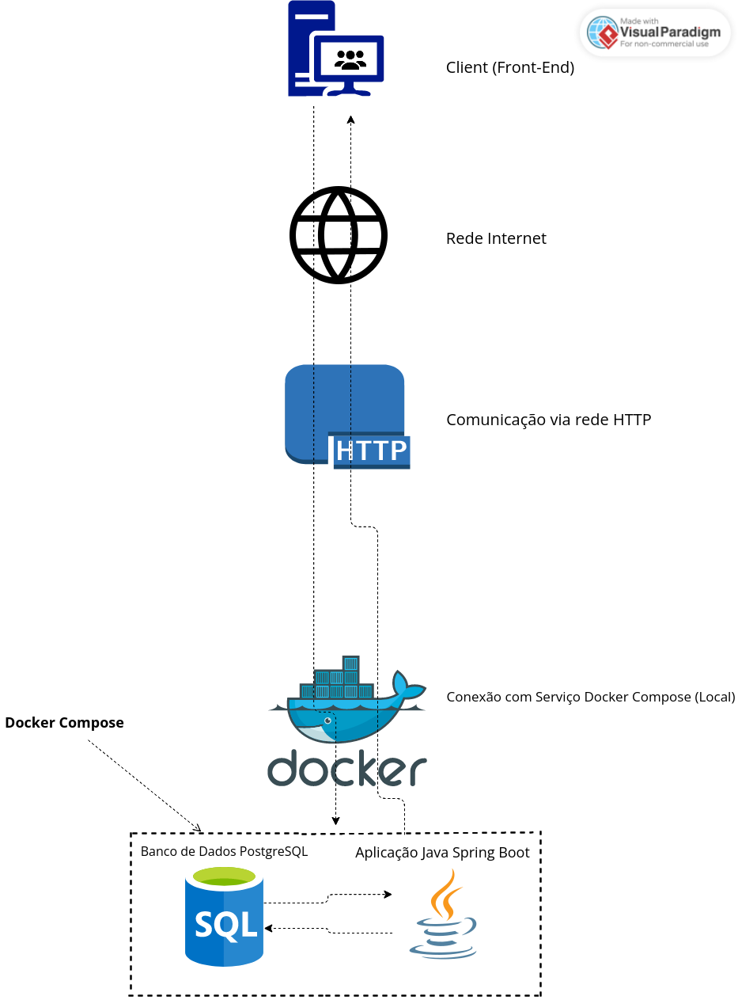
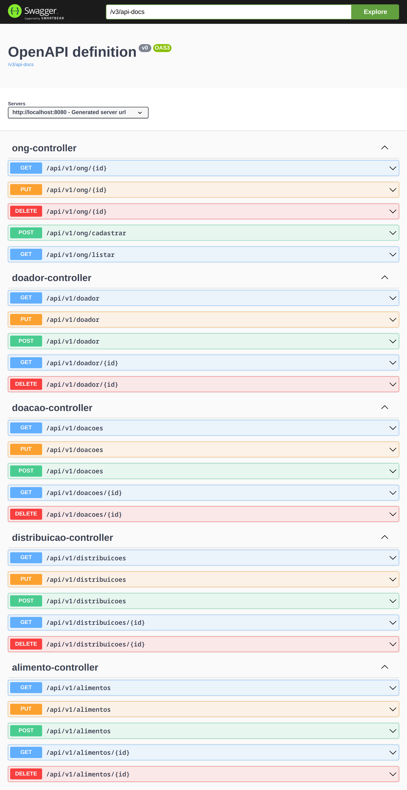

## Docker Compose Aplicação Web

## [TODO] Video: [demo da aplicação](www.youtube.com)

### Aplicação Back-end Java Spring Boot e um banco de dados PostgreSql

Estrutura do projeto:


### Documentação da API: [Swagger](http://localhost:8080/swagger-ui/index.html#/) 

- utilizamos no geral imagens leves:`postgres:alpine` & `maven:3.8.5-openjdk-17-slim`


```
# arquivo docker-compose.yaml

services:
  api:
    build: 
      context: ./backend
      ...
    ports:
      - "8080:8080"
    depends_on:
      - db
  db:
    image: postgres:alpine
    restart: always
    deploy:
      ...
    environment:
    ....
    ports:
      - "5432:5432"
    volumes:
      ...
    ...
```
O arquivo "docker-compose.yml" define um aplicativo com dois serviços `backend` e `db`.

## Deploy

```
$ docker-compose up -d --build

```

## Resultado esperado após o comando acima
```
Building api
[+] Building 1.4s (18/18) FINISHED                                                                                                                                                                                                                             
 => [internal] load build definition from Dockerfile                                                                                                                                                                                                      0.0s
 => => transferring dockerfile: 1.11kB                                                                                                                                                                                                                    0.0s
 => [internal] load .dockerignore                                                                                                                                                                                                                         0.0s
 => => transferring context: 2B                                                                                                                                                                                                                           0.0s
 => resolve image config for docker.io/docker/dockerfile:1.4                                                                                                                                                                                              0.6s
 => CACHED docker-image://docker.io/docker/dockerfile:1.4@sha256:9ba7531bd80fb0a858632727cf7a112fbfd19b17e94c4e84ced81e24ef1a0dbc                                                                                                                         0.0s
 => [internal] load metadata for docker.io/library/maven:3.8.5-openjdk-17-slim                                                                                                                                                                            0.5s
 => [internal] load metadata for docker.io/gloursdocker/docker:latest                                                                                                                                                                                     0.5s
 => FROM docker.io/gloursdocker/docker@sha256:756a5712056c43dc5028b0dc8bfd9dbd171fce27f8c6b24ae5f5839ff7f2af1f                                                                                                                                            0.0s
 => [builder 1/6] FROM docker.io/library/maven:3.8.5-openjdk-17-slim@sha256:502e781d39f0b40fbd02eb23f5b7663618b76ba52034da218c64e92f6c5647be                                                                                                              0.0s
 => [internal] load build context                                                                                                                                                                                                                         0.0s
 => => transferring context: 11.03kB                                                                                                                                                                                                                      0.0s
 => CACHED [builder 2/6] WORKDIR /workdir/server                                                                                                                                                                                                          0.0s
 => CACHED [builder 3/6] COPY pom.xml /workdir/server/pom.xml                                                                                                                                                                                             0.0s
 => CACHED [builder 4/6] RUN mvn dependency:go-offline                                                                                                                                                                                                    0.0s
 => CACHED [builder 5/6] COPY src /workdir/server/src                                                                                                                                                                                                     0.0s
 => CACHED [builder 6/6] RUN mvn install                                                                                                                                                                                                                  0.0s
 => CACHED [local-environment 1/3] RUN <<EOF (apt-get update...)                                                                                                                                                                                          0.0s
 => CACHED [local-environment 2/3] RUN <<EOF (useradd -s /bin/bash -m vscode...)                                                                                                                                                                          0.0s
 => CACHED [local-environment 3/3] COPY --from=gloursdocker/docker / /                                                                                                                                                                                    0.0s
 => exporting to image                                                                                                                                                                                                                                    0.0s
 => => exporting layers                                                                                                                                                                                                                                   0.0s
 => => writing image sha256:555f0e703774e7e846ee397c5b8908f4ab7a23b9151039af4ecbe3d356e91915        
...
```

A listando os contêineres em execução e o mapeamento de portas conforme abaixo:
```
$ docker-compose ps

       Name                      Command               State                    Ports                  
-------------------------------------------------------------------------------------------------------
global_devops_api_1   /usr/local/bin/mvn-entrypo ...   Up      0.0.0.0:8080->8080/tcp,:::8080->8080/tcp
global_devops_db_1    docker-entrypoint.sh postgres    Up      0.0.0.0:5432->5432/tcp,:::5432->5432/tcp

```

Depois que o aplicativo iniciar, navegue até `http://localhost:8080/swagger-ui/index.html#/` em seu navegador da web.



O contêiner de serviço de back-end(api) tem a porta 8080 mapeada para o host.
```
$ curl http://localhost:8080/api/users
[
  {
    "id": 1,
    "name": "thiago silva",
    "email": "thiagosilva@email.com"
  },
  {
    "id": 2,
    "name": "jose carlos",
    "email": "josecarlos22@gmail.com"
  }
]

```

Interromper os containers
```
$ docker compose down ou docker stop $(docker ps -aq)

```
